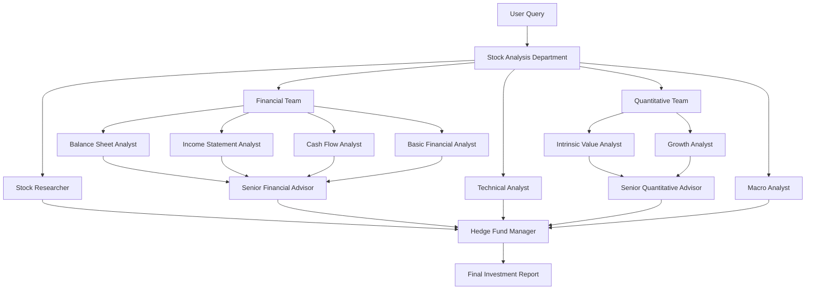

# System Architecture

## Overview

Stock Analysis Agent uses a **hierarchical multi-agent architecture** built on Google's Agent Development Kit (ADK). The system separates concerns into frontend (Next.js), backend (Python/ADK), and database (PostgreSQL) layers, with real-time streaming communication via Server-Sent Events (SSE).

## High-Level Architecture

```
┌─────────────────────────────────────────────────────────────┐
│                        Nginx (Port 80)                       │
│                    Reverse Proxy + SSL                       │
└─────────────┬───────────────────────────────────────────────┘
              │
    ┌─────────┴─────────┐
    │                   │
┌───▼──────────┐  ┌────▼─────────────┐
│   Frontend   │  │     Backend      │
│   Next.js    │  │  Python + ADK    │
│  (Port 3000) │  │   (Port 8000)    │
└──────┬───────┘  └────┬─────────────┘
       │               │
       │          ┌────▼───────┐
       │          │ PostgreSQL │
       └──────────►│ (Port 5432)│
                  └────────────┘
```

## Source Code Structure

### Backend (`/app`)
```
app/
├── agent.py                      # Root agent and hierarchical structure
├── agent_result_storage.py       # File-based result storage service
├── agent_results_api.py          # REST API for result operations
├── logging_config.py             # Simplified logging setup
└── sub_agents/                   # Specialized agent implementations
    ├── balance_sheet_analyst/
    ├── income_statement_analyst/
    ├── cash_flow_analyst/
    ├── basic_financial_analyst/
    ├── growth_analyst/
    ├── intrinsic_value_analyst/
    ├── technical_analyst/
    ├── stock_researcher/
    ├── macro_economy_analyst/
    ├── senior_financial_advisor/
    ├── senior_quantitative_advisor/
    ├── hedge_fund_manager/
    └── utils/
        ├── fmp_api_client.py     # FMP API utility
        └── llm_model.py          # LLM configuration
```

### Frontend (`/nextjs`)
```
nextjs/
├── src/
│   ├── app/
│   │   ├── api/
│   │   │   ├── auth/[...nextauth]/route.ts  # NextAuth endpoints
│   │   │   ├── health/route.ts               # Health check
│   │   │   ├── run_sse/route.ts             # SSE streaming endpoint
│   │   │   └── signup/route.ts              # User registration
│   │   ├── login/page.tsx
│   │   ├── signup/page.tsx
│   │   └── page.tsx                         # Main chat interface
│   ├── components/
│   │   ├── chat/                            # Chat UI components
│   │   │   ├── ChatContainer.tsx
│   │   │   ├── ChatContent.tsx
│   │   │   ├── ChatHeader.tsx
│   │   │   ├── ChatInput.tsx
│   │   │   ├── ChatProvider.tsx             # React Context for state
│   │   │   ├── MessageList.tsx
│   │   │   ├── MessageItem.tsx
│   │   │   ├── StreamingManager.tsx
│   │   │   └── AgentResultButtons.tsx
│   │   ├── ActivityTimeline.tsx             # Real-time activity display
│   │   └── ui/                              # shadcn/ui components
│   ├── lib/
│   │   ├── handlers/                        # Request handlers
│   │   │   ├── run-sse-common.ts
│   │   │   └── run-sse-local-backend-handler.ts
│   │   ├── streaming/                       # SSE processing
│   │   │   ├── stream-processor.ts          # Main streaming logic
│   │   │   ├── sse-parser.ts
│   │   │   ├── connection-manager.ts
│   │   │   └── types.ts
│   │   ├── api.ts                          # API utilities
│   │   ├── auth.ts                         # NextAuth configuration
│   │   └── prisma.ts                       # Database client
│   └── hooks/
│       ├── useStreaming.ts                 # SSE streaming hook
│       ├── useMessages.ts                  # Message management
│       └── useSession.ts                   # Session management
└── prisma/
    ├── schema.prisma                       # Database schema
    ├── seed.ts                             # Database seeding
    └── migrations/                         # Database migrations
```

## Agent Architecture

### Hierarchical Multi-Agent Pattern

The system uses a **three-level hierarchy**:

1. **Root Agent** ([`create_stock_analysis_company`](app/agent.py:94))
   - Coordinates the entire workflow
   - Sequential execution: Department → Hedge Fund Manager

2. **Department Level** ([`create_stock_analysis_department`](app/agent.py:81))
   - Parallel execution of specialized teams
   - Teams: Stock Research, Financial, Technical, Quantitative, Macro

3. **Team Level** (Financial Team, Quantitative Team)
   - Sequential execution within teams
   - Pattern: Parallel Analysts → Senior Advisor (synthesis)

### Agent Execution Flow



### Key Implementation Details

**Agent Definition Pattern** ([`app/agent.py`](app/agent.py:94)):
```python
def create_stock_analysis_company():
    return SequentialAgent(
        name="root_agent",
        sub_agents=[
            create_stock_analysis_department(),  # Parallel execution
            create_hedge_fund_manager_agent()    # Final synthesis
        ],
        before_agent_callback=set_session
    )
```

**Parallel + Sequential Composition**:
- [`ParallelAgent`](app/agent.py:49): Executes sub-agents concurrently
- [`SequentialAgent`](app/agent.py:61): Executes sub-agents in order
- Nested composition enables complex workflows

## Data Flow Architecture

### 1. Request Flow (User → Backend)

```
User Input → ChatInput.tsx
    ↓
useChatContext.handleSubmit()
    ↓
/api/run_sse (POST)
    ↓
run-sse-local-backend-handler.ts
    ↓
Backend: POST /run_sse
    ↓
ADK Agent Execution
```

### 2. Response Flow (Backend → User)

```
ADK Agent (SSE Stream)
    ↓
stream-processor.ts
    ↓ (processes events)
├── Function Calls → ActivityTimeline
├── Thoughts → ActivityTimeline
├── Text (hedge_fund_manager) → MessageList
└── Text (other agents) → agent_result_storage.py
```

### 3. Agent Result Storage

```
Agent Completion
    ↓
stream-processor.ts detects completion
    ↓
saveAgentResultCallback()
    ↓
agent_result_storage.py
    ↓
Filesystem: results/user_{id}/session_{id}/{agent}.json
```

## Streaming Architecture

### SSE (Server-Sent Events) Pattern

The system implements the **Official ADK Termination Signal Pattern**:

1. **Streaming Chunks**: Text arrives in parts, accumulated progressively
2. **Termination Signal**: Complete response matches accumulated text
3. **Display Logic**: Only hedge_fund_manager_agent text shown to user

**Key Files**:
- [`stream-processor.ts`](nextjs/src/lib/streaming/stream-processor.ts): Processes SSE events into UI updates
- [`sse-parser.ts`](nextjs/src/lib/streaming/sse-parser.ts): Extracts data from SSE JSON
- [`connection-manager.ts`](nextjs/src/lib/streaming/connection-manager.ts): Manages SSE connections

### Event Processing Flow

```
SSE Event → processSseEventData()
    ↓
├── Extract textParts
├── Extract thoughtParts  
├── Extract functionCall
└── Extract functionResponse
    ↓
├── processTextContent() → MessageList (hedge_fund_manager only)
├── processThoughts() → ActivityTimeline (all agents)
├── processFunctionCall() → ActivityTimeline (all agents)
└── processFunctionResponse() → ActivityTimeline (all agents)
```

## Database Architecture

### PostgreSQL Schema

```prisma
model User {
  id        String   @id @default(cuid())
  email     String   @unique
  name      String?
  password  String   // bcrypt hashed
  role      String   @default("user")
  createdAt DateTime @default(now())
  updatedAt DateTime @updatedAt
}
```

**Current State**:
- Only user authentication stored in database
- Chat sessions/messages stored in memory (not persisted)
- Agent results stored in filesystem (not in DB)

**Future Consideration**:
- Add Session and Message models for persistence
- Add AgentResult model for database storage

## Authentication Architecture

### NextAuth.js Setup

**Flow**:
1. User submits credentials → `/api/auth/[...nextauth]`
2. Credentials provider validates against PostgreSQL
3. JWT token created with user ID and role
4. Session maintained across requests

**Admin Seeding** ([`prisma/seed.ts`](nextjs/prisma/seed.ts)):
- Automatically creates admin user on startup
- Credentials from environment variables
- Only if admin doesn't already exist

## Deployment Architecture

### Docker Containerization

**Four Services**:
1. **postgres**: PostgreSQL 15 Alpine
2. **stock-analysis-backend**: Python/ADK backend
3. **stock-analysis-frontend**: Next.js frontend
4. **nginx**: Reverse proxy

**Health Checks**:
- Each service has health check endpoints
- Dependencies managed via `depends_on` with conditions
- Proper startup order: postgres → backend → frontend → nginx

### Network Architecture

```
External Traffic (Port 80)
    ↓
NGINX (Reverse Proxy)
    ↓
┌─────────────┬──────────────┐
│             │              │
Frontend    Backend      PostgreSQL
(3000)      (8000)       (5432)
    │           │              │
└─────────────┴──────────────┘
    stock-analysis-network
    (172.20.0.0/16)
```

## Key Design Patterns

### 1. **Strategy Pattern** (Deployment Handlers)
- [`run-sse-local-backend-handler.ts`](nextjs/src/lib/handlers/run-sse-local-backend-handler.ts): Local backend strategy
- Easily extensible for other deployment types

### 2. **Observer Pattern** (SSE Streaming)
- Backend publishes events
- Frontend subscribes and reacts to updates

### 3. **Facade Pattern** (API Layer)
- [`api.ts`](nextjs/src/lib/api.ts) provides simple interface to complex backend operations
- [`fmp_api_client.py`](app/sub_agents/utils/fmp_api_client.py) abstracts FMP API complexity

### 4. **Context Pattern** (React State)
- [`ChatProvider.tsx`](nextjs/src/components/chat/ChatProvider.tsx) provides centralized state
- Components consume via `useChatContext()`

### 5. **Repository Pattern** (Agent Results)
- [`agent_result_storage.py`](app/agent_result_storage.py) abstracts storage details
- Easy to switch from filesystem to database later

## Critical Implementation Paths

### For Stock Analysis Request:
1. [`nextjs/src/components/chat/ChatInput.tsx`](nextjs/src/components/chat/ChatInput.tsx) → User input
2. [`nextjs/src/lib/api.ts`](nextjs/src/lib/api.ts) → API call preparation
3. [`nextjs/src/app/api/run_sse/route.ts`](nextjs/src/app/api/run_sse/route.ts) → Request routing
4. [`nextjs/src/lib/handlers/run-sse-local-backend-handler.ts`](nextjs/src/lib/handlers/run-sse-local-backend-handler.ts) → Backend communication
5. [`app/agent.py`](app/agent.py) → Agent orchestration
6. `app/sub_agents/*/agent.py` → Specialized analysis
7. [`nextjs/src/lib/streaming/stream-processor.ts`](nextjs/src/lib/streaming/stream-processor.ts) → Response processing
8. [`nextjs/src/components/chat/MessageList.tsx`](nextjs/src/components/chat/MessageList.tsx) → Display results

### For Agent Result Storage:
1. [`stream-processor.ts`](nextjs/src/lib/streaming/stream-processor.ts) → Detect agent completion
2. `saveAgentResultCallback()` → Trigger save
3. [`agent_result_storage.py`](app/agent_result_storage.py) → Save to filesystem
4. [`agent_results_api.py`](app/agent_results_api.py) → Provide REST access (future use)

## Performance Considerations

- **Parallel Agent Execution**: Financial and Quantitative teams run analysts in parallel
- **Streaming Display**: Progressive text display prevents blocking UI
- **React Context**: Minimizes prop drilling and re-renders
- **Connection Pooling**: PostgreSQL connections managed by Prisma
- **Docker Networking**: Internal network for service communication

## Security Considerations

- **Password Hashing**: bcrypt with salt rounds
- **JWT Tokens**: Session management via NextAuth
- **Environment Variables**: Sensitive data not in code
- **Network Isolation**: Docker internal network
- **CORS**: Configured for specific origins
- **API Key Management**: FMP API key in environment variables