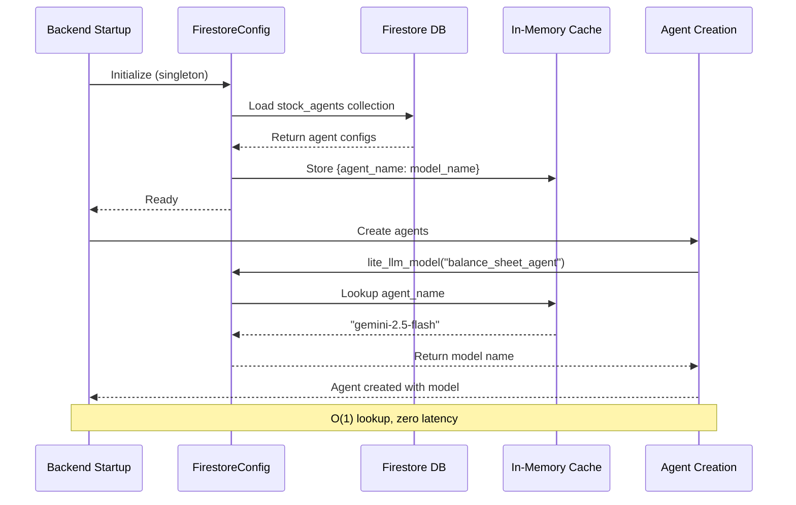
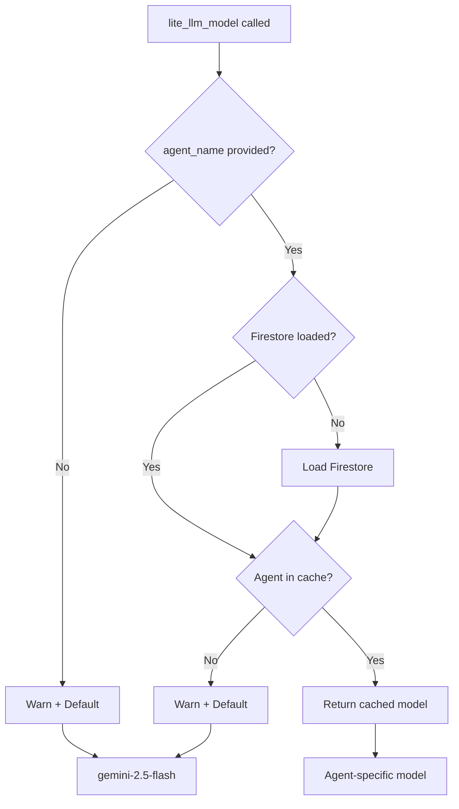

# Firestore Integration Plan for Dynamic Agent Model Configuration

## 📋 Overview

This plan outlines the integration of Google Firestore to enable dynamic AI model configuration for all 11 specialized agents in the Stock Analysis Agent system. The goal is to allow administrators to change which LLM model each agent uses via Firebase Console without requiring code changes or redeployment.

## 🎯 Objectives

1. **Dynamic Model Configuration**: Load agent-to-model mappings from Firestore at startup
2. **Zero Runtime Overhead**: Use in-memory cache for O(1) model lookups during execution  
3. **Graceful Fallback**: System continues operating with default models if Firestore fails
4. **Agent-Specific Models**: Support different models per agent (e.g., hedge_fund_manager uses gemini-2.5-pro while others use gemini-2.5-flash)

## 🏗️ Current vs. Target Architecture

### Current State
```python
# app/sub_agents/utils/llm_model.py
def lite_llm_model():
    return "gemini-2.5-flash"  # Hardcoded for all agents

# Agent creation
def create_balance_sheet_agent():
    return LlmAgent(
        model=lite_llm_model(),  # No agent context
        ...
    )
```

### Target State
```python
# app/sub_agents/utils/llm_model.py
def lite_llm_model(agent_name: str) -> str:
    return FirestoreConfig.get_model(agent_name)  # Dynamic lookup

# Agent creation
def create_balance_sheet_agent():
    return LlmAgent(
        model=lite_llm_model("balance_sheet_agent"),  # Agent-specific
        ...
    )
```

## 🔄 System Flow Diagram



## 🗂️ Firestore Schema

### Collection: `stock_agents`

| Document ID | Field: llm_model |
|------------|------------------|
| balance_sheet_agent | gemini-2.5-flash |
| income_statement_agent | gemini-2.5-flash |
| cash_flow_statement_agent | gemini-2.5-flash |
| basic_financial_analyst_agent | gemini-2.5-flash |
| senior_financial_advisor_agent | gemini-2.5-flash |
| stock_researcher_agent | gemini-2.5-flash |
| technical_analyst_agent | gemini-2.5-flash |
| intrinsic_value_analyst_agent | gemini-2.5-flash |
| growth_analyst_agent | gemini-2.5-flash |
| senior_quantitative_advisor_agent | gemini-2.5-flash |
| macro_economy_analyst_agent | gemini-2.5-flash |
| hedge_fund_manager_agent | gemini-2.5-pro |

## 📦 Implementation Tasks (Taskmaster AI)

### Task 1: Add Firestore Python SDK and Environment Configuration ⚙️
**Priority**: High | **Dependencies**: None

Add `firebase-admin>=6.0.0` to [`pyproject.toml`](pyproject.toml:8). Configure environment variables:

```bash
# .env and .env.production
FIREBASE_PROJECT_ID=stock-analysis-agent-a7bff
FIREBASE_CREDENTIALS_PATH=/path/to/service-account-key.json
```

Create [`guide/FIRESTORE_SETUP.md`](guide/FIRESTORE_SETUP.md) documenting credential setup.

---

### Task 2: Implement Firestore Client Initialization 🔌
**Priority**: High | **Dependencies**: Task 1

Create [`app/sub_agents/utils/firestore_config.py`](app/sub_agents/utils/firestore_config.py) with singleton pattern:

```python
import firebase_admin
from firebase_admin import credentials, firestore

class FirestoreClient:
    _instance = None
    
    def __new__(cls):
        if cls._instance is None:
            cred = credentials.Certificate(os.getenv('FIREBASE_CREDENTIALS_PATH'))
            firebase_admin.initialize_app(cred)
            cls._instance = firestore.client()
        return cls._instance
```

---

### Task 3: Create Centralized Model Configuration Service 🗄️
**Priority**: High | **Dependencies**: Task 2

Implement configuration loader in [`app/sub_agents/utils/firestore_config.py`](app/sub_agents/utils/firestore_config.py):

```python
class FirestoreConfig:
    _cache = {}
    _loaded = False
    
    @classmethod
    def load_configs(cls) -> None:
        """Load all agent configs at startup (called once)"""
        if cls._loaded:
            return
            
        try:
            client = FirestoreClient()
            docs = client.collection('stock_agents').stream()
            
            for doc in docs:
                agent_name = doc.id
                model_name = doc.to_dict().get('llm_model', 'gemini-2.5-flash')
                cls._cache[agent_name] = model_name
                
            cls._loaded = True
            logger.info(f"Loaded {len(cls._cache)} agent configurations")
        except Exception as e:
            logger.warning(f"Failed to load Firestore configs: {e}")
            cls._loaded = True  # Prevent retry loop
    
    @classmethod
    def get_model(cls, agent_name: str) -> str:
        """Get model name for agent (O(1) lookup)"""
        if not cls._loaded:
            cls.load_configs()
        return cls._cache.get(agent_name, 'gemini-2.5-flash')
```

**Key Design Decisions**:
- Load once at startup (before agent creation)
- Cache in memory for instant lookup
- Timeout: 5 seconds max for Firestore connection
- Parallel loading if collection is large

---

### Task 4: Modify llm_model.py for Dynamic Model Lookup 🔍
**Priority**: High | **Dependencies**: Task 3

Refactor [`app/sub_agents/utils/llm_model.py`](app/sub_agents/utils/llm_model.py:3):

```python
from .firestore_config import FirestoreConfig

def lite_llm_model(agent_name: str = None) -> str:
    """
    Returns the model name for the specified agent.
    Falls back to default if agent not found.
    
    Args:
        agent_name: Name of the agent (e.g., 'balance_sheet_agent')
    
    Returns:
        Model name string (e.g., 'gemini-2.5-flash')
    """
    if agent_name is None:
        logger.warning("lite_llm_model called without agent_name, using default")
        return "gemini-2.5-flash"
    
    model = FirestoreConfig.get_model(agent_name)
    logger.debug(f"Agent '{agent_name}' using model '{model}'")
    return model
```

---

### Task 5: Update Agent Creation Functions 🤖
**Priority**: Medium | **Dependencies**: Task 4

Update all 11 agent creation functions to pass agent_name:

**Example** - [`app/sub_agents/balance_sheet_analyst/agent.py`](app/sub_agents/balance_sheet_analyst/agent.py:7):
```python
def create_balance_sheet_agent():
    return LlmAgent(
        name="balance_sheet_agent",
        model=lite_llm_model("balance_sheet_agent"),  # ✅ Pass agent name
        ...
    )
```

**All agents to update**:
1. ✅ balance_sheet_agent
2. ✅ income_statement_agent  
3. ✅ cash_flow_statement_agent
4. ✅ basic_financial_analyst_agent
5. ✅ senior_financial_advisor_agent
6. ✅ stock_researcher_agent
7. ✅ technical_analyst_agent
8. ✅ intrinsic_value_analyst_agent
9. ✅ growth_analyst_agent
10. ✅ senior_quantitative_advisor_agent
11. ✅ macro_economy_analyst_agent
12. ✅ hedge_fund_manager_agent

---

### Task 6: Implement Robust Error Handling and Logging 🛡️
**Priority**: High | **Dependencies**: Tasks 3, 4

Add comprehensive error handling in [`firestore_config.py`](app/sub_agents/utils/firestore_config.py):

```python
import logging
logger = logging.getLogger(__name__)

class FirestoreConfig:
    @classmethod
    def load_configs(cls) -> None:
        try:
            # ... Firestore loading code
        except FileNotFoundError as e:
            logger.error(f"Credentials file not found: {e}")
        except Exception as e:
            logger.error(f"Firestore connection failed: {e}")
            logger.warning("Using default models for all agents")
        finally:
            cls._loaded = True
```

**Error Scenarios**:
- ❌ Firestore unavailable → Use default models
- ❌ Missing agent config → Use default model
- ❌ Invalid model name → Use default model
- ✅ Log all warnings for debugging

---

### Task 7: Write Unit and Integration Tests 🧪
**Priority**: Medium | **Dependencies**: Tasks 5, 6

Create test files:
- `tests/test_firestore_config.py` - Unit tests with mock Firestore
- `tests/test_agent_models.py` - Integration tests with real Firestore

**Test Cases**:
1. ✅ Load all 11 agent configs successfully
2. ❌ Handle missing agent config gracefully
3. ❌ Handle Firestore connection failure
4. ✅ Verify cache hit rate is 100%
5. ✅ Test model change via Firebase Console (manual)

---

### Task 8: Document Setup and Configuration 📚
**Priority**: Medium | **Dependencies**: All previous tasks

Create documentation:

1. **[`guide/FIRESTORE_SETUP.md`](guide/FIRESTORE_SETUP.md)**
   - Firebase service account creation
   - Credential file setup
   - Environment variable configuration
   - Initial Firestore data population

2. **[`guide/MODEL_CONFIGURATION.md`](guide/MODEL_CONFIGURATION.md)**  
   - How to change models via Firebase Console
   - Supported model names list
   - When changes take effect (restart required)
   - Troubleshooting common issues

## 🔑 Critical Implementation Points

### 1. When to Load Firestore Configurations

**Timing**: At backend startup, **before** agent creation

```python
# In app/__init__.py or main entry point
from app.sub_agents.utils.firestore_config import FirestoreConfig

# Step 1: Load configs FIRST
FirestoreConfig.load_configs()

# Step 2: Create agents (will use cached configs)
from app.agent import create_root_agent
root_agent = create_root_agent()
```

**Why**:
- Ensures configurations are ready before any agent is created
- Prevents race conditions
- Single loading point, easy to debug

### 2. Real-time Updates

**Current Scope**: ❌ Real-time updates NOT supported

**Reason**: Agents are created once at startup. Changing configs requires:
1. Update Firestore via Firebase Console
2. Restart backend service

**Future Enhancement**: Listen to Firestore changes and reload configs hot-swap (out of scope for now)

### 3. Fallback Strategy



**Default Model**: `gemini-2.5-flash`

**Fallback Triggers**:
- Firestore connection fails
- Agent config missing from Firestore
- Invalid model name in config
- No agent_name provided

## 📊 Performance Considerations

| Metric | Target | Implementation |
|--------|--------|----------------|
| Startup Overhead | < 5 seconds | Single Firestore query at startup |
| Runtime Lookup | O(1) | Dictionary cache lookup |
| Memory Usage | < 10 KB | 11 agent configs in memory |
| Cache Hit Rate | 100% | Pre-loaded at startup |

## 🔒 Security Considerations

1. **Service Account Credentials**
   - ❌ Never commit JSON file to git
   - ✅ Add `*service-account*.json` to `.gitignore`
   - ✅ Store in secure location outside repo
   - ✅ Use environment variable for path

2. **Firestore Permissions**
   - Service account needs: **Firestore Read** permission only
   - No write permission required for backend

3. **Environment Variables**
   - Use `.env` for development
   - Use `.env.production` for production
   - Document required variables

## 🚀 Deployment Steps

1. **Development**
   ```bash
   # Install dependencies
   uv sync
   
   # Set environment variables in .env
   FIREBASE_PROJECT_ID=stock-analysis-agent-a7bff
   FIREBASE_CREDENTIALS_PATH=./credentials/service-account.json
   
   # Start backend
   make dev-backend
   ```

2. **Production (Docker)**
   ```dockerfile
   # Mount credentials as volume
   volumes:
     - ./credentials:/app/credentials:ro
   
   # Set environment in .env.production
   FIREBASE_CREDENTIALS_PATH=/app/credentials/service-account.json
   ```

3. **Verify**
   - Check logs for "Loaded N agent configurations"
   - Query each agent's model via logs
   - Test with actual stock analysis request

## 🎓 Acceptance Criteria

✅ **Functionality**
- [ ] All 11 agents load model configs from Firestore
- [ ] `lite_llm_model("balance_sheet_agent")` returns correct model
- [ ] Changing model in Firebase Console takes effect after restart
- [ ] System works normally when Firestore unavailable (fallback)

✅ **Performance**  
- [ ] Startup time increases by < 5 seconds
- [ ] No latency impact during user requests
- [ ] Configuration cache hit rate: 100%

✅ **Reliability**
- [ ] System never fails to start due to Firestore issues
- [ ] All error conditions properly logged
- [ ] Missing configs use sensible defaults

## 📝 Next Steps

1. **Review this plan** - Does the architecture make sense? Any concerns?
2. **Confirm setup** - Do you have Firebase service account credentials ready?
3. **Approve implementation** - Ready to switch to Code mode and start implementing?

## ❓ Questions for Review

1. **Model Selection**: Is `gemini-2.5-pro` only for hedge_fund_manager appropriate?
2. **Restart Requirement**: Is manual restart acceptable for model changes?
3. **Error Handling**: Should we send alerts when Firestore connection fails?
4. **Testing**: Do you want automated tests for Firebase Console changes?

---

**Generated by**: Kilo Code Architect Mode  
**Task Management**: Taskmaster AI MCP  
**Tag**: `firestore-integration`